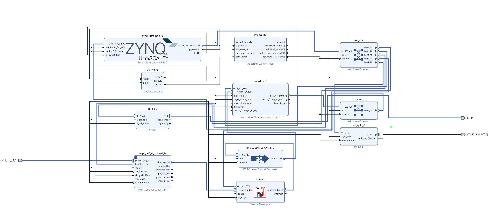

This is an attempt to get the PCAM5 working on an AUP-ZU3 board w/ Vivado 2025.x


## Current status from my notes is....
 *ITS WORKING!!*


## Progress notes 

Notes (2026-04-08) (*yahoo!*)
- Frames flowing through pipeline :D
- Getting VDMA errors but no kernel hanging
- (likely) tlast and tready timing mismatches causing left side pixels from old frame to wrap around onto the new one (so the right most 50 columns are actually the leftmost...)
- Some exposure and color correction issues - this is almost certainly register related not HW
- IMPORTANT: Color mode from camera is BGR so data must be flipped
- Bayer mode 0x00 for demosaic
- For most computer vision and AR/VR related projects this should be fine since you'll be doing downscaling + cropping anyways so this is basically a non-starter issue. On the other hand, it looks downright awful if you're going in looking for high quality pictures, but that's more register issues for image quality and this is serviceable for probably most applications.
- Check the updated python/notebook scripts to see what was changed as well (sorry these might not get updated yet)
- Main thing was discretizing all of the funcitons for legibility.
- Also fixed the RAW10-8 mismatch and added in a downconverter for AXI4-Stream to convert RBG10 to RGB888.


Notes (2026-04-07)
- Frame count increasing on camera
- Stop appears to be held high regardless
- Active frame also high (indicates working I think?)
- Likely issue with data input mismatch - was using RAW10 output from cam into RAW8 input into demosaic
- Will look to the ILA for help now (please save me)


Current statsus *not* from my notes (rambling) is that the design runs on 2 clock domains - 175 and 200MHz for AXI-Lite + video pipeline, and PCAM5 input frames respectively. 
Frames now flow *live* from the PCAM to main memory. Unsure of actual latency since jupyter makes that near impossible to judge. Similarly exact framerate is hard to gauge but looks good.


## TODO
- Fix edge frame issues (visible in above image)
- Add support for more image modes
- Write documentation for python initialization
- 


Basic initialization looks like

Power cycle PCAM --> Load initial PCAM config --> Load vid/pic specific config (1920*1080@30fps) --> Initialize VDMA + demosaic --> Start camera --> Success?


## Hardware Pipeline

```

        (AXI)                    (Memory witchcraft)
   IIC <─────── MPSoC / PS <─────────────────────────┐
    │              Ʌ                                 │
    │ (IIC) duh    │      (AXI)                      │
    │              ├─────────────┐──────────┐        │
    V              V             V          V        V
 PCAM5C ──> MIPI CSI-2 RX ──> Demosaic ──> VDMA ──> DDR
 (Dual lane)                (AXI4-Stream pipeline)


```


Heres the actual pipeline!
        V





Feel free to contribute since this is mind-numbingly hard to figure out. PYNQ files (if not present already) will be added shortly along with specific vivado version, board specs and anything else that I think might be useful.

Cheers and good luck! :P


Freya (Henry)


## Open Source and AI USE DISCLAIMER
Please be aware that this endeavor used Google's Gemini agent to inspect TCL scripts and point out data mismatches. Gemini was also used to initially write python scripts, but as it turns out, Gemini doesn't read the documentation so virtually all scripting (not including comments left from gemini and some small debug scripts like the pipeline diagnostic def) has either been rewritten or heavily modified by me. The debugging scripts at the bottom should not be included in this assessment and they are basically all written by AI agents and insta-bricks for the pipeline.

Additionally, as commented in PYNQ_SCRIPTS\pcam5c_register_configs.py, the config files were adapted from Digilents PCAM5 demo since there is no other place to find them. (The register mappings are basically impossible to find... as I understand they're under NDA?) 

Other sources used were primarily the manuals for respective IPs, so credit again to digilent/xilinx/amd/vivado.